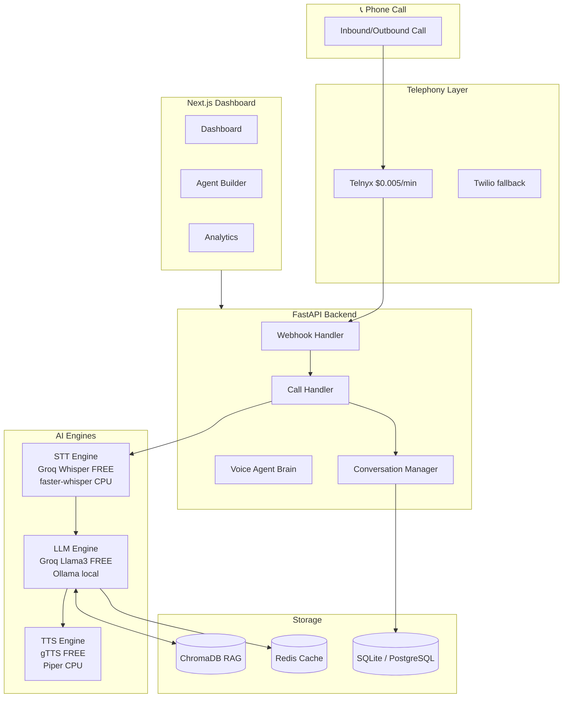

# AgenticP1 — AI Calling Agent Platform

> **Enterprise-grade AI Voice Calling Agent SaaS — Built to run for $5-20/month on a CPU-only VPS**

Transform your customer support with AI-powered phone agents that never sleep, never get tired, and cost a fraction of traditional call centers. Built for small businesses and enterprises alike.

[](https://github.com/ParamJaiswal/AgenticP1/actions/workflows/ci.yml)
[](LICENSE)
[](https://python.org)
[](https://nextjs.org)

---

## 🎯 What is AgenticP1?

AgenticP1 is a **complete, production-ready AI Voice Calling Agent SaaS** that you can:

- 🏢 **Deploy for your own business** — handle customer calls 24/7 without hiring more staff
- 💼 **Sell as a service** — white-label and resell to dental clinics, real estate agencies, e-commerce stores, and more
- 🚀 **Run ultra-cheap** — designed to run on a **$5-20/month VPS** serving 20-50 clients

---

## ✨ Features

### 🤖 AI Voice Agent
- **Real-time voice conversations** powered by Groq's free Llama 3 API
- **Sub-second latency** speech processing via WebSocket streaming
- **Multi-language support** (English + 99 languages via Whisper)
- **Smart interruption handling** — knows when the caller is done speaking
- **Emotion & sentiment detection** — escalates angry customers automatically

### 🧠 Intelligent Capabilities
- **Function calling** — books appointments, checks orders, sends SMS
- **Knowledge Base (RAG)** — answers questions from uploaded PDFs, URLs, docs
- **Multi-tenant** — each company gets isolated agents, data, and configuration
- **Escalation logic** — transfers to human agents based on rules

### 💰 Cost-First Architecture
- **LLM**: Groq FREE API (Llama 3.1 8B) → 14,400 requests/day at $0
- **STT**: Groq Whisper API (FREE) → fallback to faster-whisper on CPU
- **TTS**: gTTS / Edge TTS (FREE) → or Piper TTS (offline, CPU)
- **Telephony**: Telnyx (~$0.005/min) — 60% cheaper than Twilio
- **Database**: SQLite (default, zero cost) or PostgreSQL for production
- **Vector DB**: ChromaDB (embedded, no external service)

### 📊 Business Dashboard
- Real-time call monitoring
- Analytics: call volume, sentiment trends, resolution rates
- Agent builder (no-code configuration)
- Knowledge base management (drag & drop upload)
- Usage & billing tracking

---

## 💵 Cost Comparison

| Component | Traditional Stack | **AgenticP1** |
|-----------|:-----------------:|:-------------:|
| LLM | $15-60/1M tokens (GPT-4) | **$0** (Groq free tier) |
| STT | $0.006/min (Deepgram) | **$0** (Groq Whisper free) |
| TTS | $0.30/1K chars (ElevenLabs) | **$0** (gTTS/Edge TTS) |
| Telephony | $0.013/min (Twilio) | **$0.005/min** (Telnyx) |
| **Cost per 5-min call** | **$0.50–$2.00+** | **~$0.025** |
| **Savings** | baseline | **95-98% cheaper** |

**For 20 clients each making 100 calls/month (5 min avg):**
- Traditional stack: ~$2,000-8,000/month
- AgenticP1: ~$50/month server + $25 telephony = **~$75/month**

---

## 🏗️ Architecture



---

## 🚀 Quick Start

### Prerequisites
- Docker & Docker Compose
- A free [Groq API key](https://console.groq.com) (for LLM + STT)

### 3-Command Setup

```bash
# 1. Clone the repo
git clone https://github.com/ParamJaiswal/AgenticP1.git
cd AgenticP1

# 2. Configure your environment
cp .env.example .env
# Edit .env — minimum: set GROQ_API_KEY

# 3. Launch! 🚀
docker-compose up --build
```

Or use the one-command setup script:
```bash
bash scripts/setup.sh
```

**Then open:**
- 🖥️ Dashboard: http://localhost:3000
- 📖 API Docs: http://localhost:8000/docs

---

## ⚙️ Configuration Guide

### LLM Provider

```bash
# FREE — Groq API (recommended for first 14,400 req/day)
LLM_PROVIDER=groq
GROQ_API_KEY=gsk_xxxxx
LLM_MODEL=llama-3.1-8b-instant     # Fast, free

# FREE — Self-hosted Ollama (unlimited, requires local server)
LLM_PROVIDER=ollama
OLLAMA_BASE_URL=http://localhost:11434
OLLAMA_MODEL=mistral:7b

# Paid fallback — Together AI ($0.18/1M tokens)
TOGETHER_API_KEY=your_key

# Paid fallback — OpenAI GPT-4o-mini ($0.15/1M tokens)
OPENAI_API_KEY=your_key
```

### STT Provider

```bash
# FREE — Groq Whisper (recommended)
STT_PROVIDER=groq_whisper

# FREE — Local faster-whisper (CPU, no internet needed)
STT_PROVIDER=faster_whisper
WHISPER_MODEL_SIZE=tiny   # tiny=fastest, medium=most accurate

# FREE — Vosk (ultra-lightweight, offline)
STT_PROVIDER=vosk
VOSK_MODEL_PATH=./data/models/vosk
```

### TTS Provider

```bash
# FREE — gTTS (Google, requires internet)
TTS_PROVIDER=gtts

# FREE — Microsoft Edge TTS (high quality, requires internet)
TTS_PROVIDER=edge_tts
EDGE_TTS_VOICE=en-US-JennyNeural

# FREE — Piper TTS (offline, neural, CPU-only)
TTS_PROVIDER=piper
PIPER_VOICE=en_US-amy-low
# Download models: https://github.com/rhasspy/piper/releases
```

### Telephony

```bash
# Telnyx — cheapest ($0.005/min)
TELEPHONY_PROVIDER=telnyx
TELNYX_API_KEY=KEY_xxxxx
TELNYX_CONNECTION_ID=xxxxx
TELNYX_PHONE_NUMBER=+15551234567

# Twilio — fallback ($0.013/min)
TELEPHONY_PROVIDER=twilio
TWILIO_ACCOUNT_SID=xxxxx
TWILIO_AUTH_TOKEN=xxxxx
```

---

## 📡 API Documentation

### Authentication

```bash
# Register
curl -X POST http://localhost:8000/api/v1/auth/register \
  -H "Content-Type: application/json" \
  -d '{"email":"you@company.com","password":"pass123","full_name":"John","organization_name":"Acme Corp"}'

# Login
curl -X POST http://localhost:8000/api/v1/auth/login \
  -H "Content-Type: application/json" \
  -d '{"email":"you@company.com","password":"pass123"}'
# Returns: {"access_token": "eyJ..."}
```

### Agents

```bash
# Create an agent
curl -X POST http://localhost:8000/api/v1/agents/ \
  -H "Authorization: Bearer $TOKEN" \
  -H "Content-Type: application/json" \
  -d '{
    "name": "Dental Support",
    "industry": "healthcare",
    "personality": "professional",
    "greeting_message": "Hello! Thank you for calling. How can I help?",
    "tools_enabled": {"book_appointment": true, "transfer_to_human": true}
  }'
```

### Calls

```bash
# List calls
curl http://localhost:8000/api/v1/calls/ \
  -H "Authorization: Bearer $TOKEN"

# Initiate outbound call
curl -X POST http://localhost:8000/api/v1/calls/initiate \
  -H "Authorization: Bearer $TOKEN" \
  -d '{"to_number": "+15551234567", "agent_id": "your-agent-id"}'
```

### Knowledge Base

```bash
# Upload a PDF
curl -X POST http://localhost:8000/api/v1/knowledge/upload \
  -H "Authorization: Bearer $TOKEN" \
  -F "file=@company_faq.pdf"

# Add a URL
curl -X POST http://localhost:8000/api/v1/knowledge/url \
  -H "Authorization: Bearer $TOKEN" \
  -d '{"url": "https://yourcompany.com/faq"}'
```

Full interactive docs: http://localhost:8000/docs

---

## 🚀 Deployment Guide

### VPS Deployment (DigitalOcean / Hetzner / Vultr)

**Minimum specs:** 2 CPU cores, 2GB RAM, 20GB SSD — ~$5-12/month

```bash
# On your VPS (Ubuntu 22.04):
apt update && apt install -y docker.io docker-compose-plugin git
git clone https://github.com/ParamJaiswal/AgenticP1.git
cd AgenticP1
cp .env.example .env.prod
nano .env.prod  # Edit with production values
docker-compose -f docker-compose.prod.yml up -d
```

### Recommended VPS Providers (Cost-Optimized)

| Provider | Plan | Price | Notes |
|----------|------|-------|-------|
| **Hetzner** | CX22 | €4.5/mo | Best value, EU datacenter |
| **DigitalOcean** | Basic Droplet | $6/mo | Easy UI, reliable |
| **Vultr** | Cloud Compute | $5/mo | Good network, global DCs |
| **Contabo** | VPS S | €5/mo | Massive RAM, slower network |

---

## 💼 Business Model — Reselling to Businesses

### Suggested Pricing Tiers

| Plan | Monthly Price | Minutes | Best For |
|------|:------------:|:-------:|----------|
| **Starter** | $49/mo | 500 min | Small clinic, <50 calls/day |
| **Growth** | $149/mo | 2,000 min | Mid-size business, 50-200 calls/day |
| **Pro** | $399/mo | 10,000 min | Call center replacement |
| **Enterprise** | $999/mo | Unlimited | Large enterprises |

### Your Profit Margin
For 20 clients on Growth plan ($149/month):
- Revenue: 20 × $149 = **$2,980/month**
- Costs: $12 VPS + ~$50 telephony (Telnyx) = **~$62/month**
- **Gross profit: ~$2,918/month (~98% margin)**

### Target Industries
- 🦷 **Dental/Medical clinics** — appointment booking, reminders
- 🏠 **Real Estate** — lead qualification, property inquiries
- 🛒 **E-commerce** — order status, returns, customer support
- 🍕 **Restaurants** — reservations, menu questions, hours
- ⚖️ **Legal/Finance** — initial consultations, FAQ answering

---

## 🛠️ Tech Stack

| Layer | Technology | Why |
|-------|-----------|-----|
| **Backend** | Python 3.11, FastAPI | Async, fast, great ecosystem |
| **LLM** | Groq API (Llama 3) | FREE tier, ultra-fast |
| **STT** | Groq Whisper API | FREE tier, very accurate |
| **TTS** | gTTS / Edge TTS / Piper | Free, good quality |
| **Telephony** | Telnyx | Cheapest SIP at $0.005/min |
| **Database** | SQLite / PostgreSQL | Zero cost start, scales |
| **Vector DB** | ChromaDB | Embedded, free, no external service |
| **Cache** | Redis | Response caching, cost reduction |
| **Frontend** | Next.js 15, Tailwind CSS | Modern, fast, SEO-friendly |
| **Auth** | JWT + bcrypt | Secure, stateless |
| **Deployment** | Docker + Docker Compose | Simple, portable |

---

## 🧪 Testing

```bash
# Run all backend tests
make test

# With coverage report
make test-cov

# Lint
make lint
```

---

## 🤝 Contributing

1. Fork the repository
2. Create a feature branch: `git checkout -b feature/your-feature`
3. Make your changes with tests
4. Ensure lint passes: `make lint`
5. Submit a Pull Request

---

## 📄 License

MIT License — see [LICENSE](LICENSE) for details.

---

## 🙋 Support

- 📖 **API Docs**: http://localhost:8000/docs
- 🐛 **Issues**: [GitHub Issues](https://github.com/ParamJaiswal/AgenticP1/issues)
- 💬 **Discussions**: [GitHub Discussions](https://github.com/ParamJaiswal/AgenticP1/discussions)

---

*Built with ❤️ to democratize AI-powered customer service for businesses of all sizes.*
